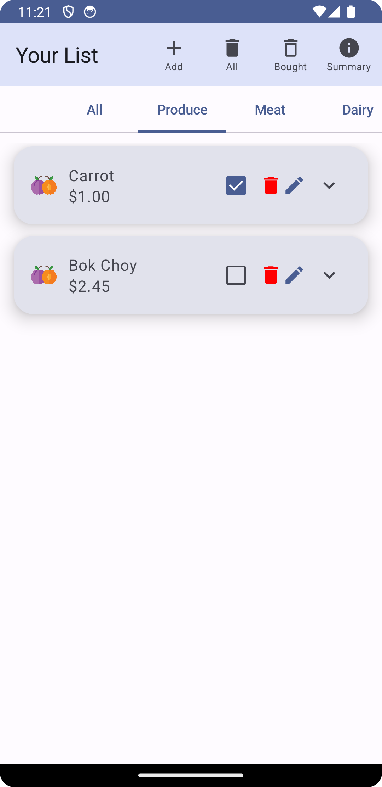

# FickStopShop

## Description
This is an app designed for aiding users in their shopping at a supermarket. The app will allow users to create a shopping list, and then the app will sort the list by category, and view just by these categories.

## Implementation
The app implements a SQLite database framework for local storage of the shopping items, and also ROOM object relation mapping, as well as dependency injection with HILT. 

## Usage
To run, simply press play on the emulator in Android Studio, and have fun!

## Example Screens

  
   
  

